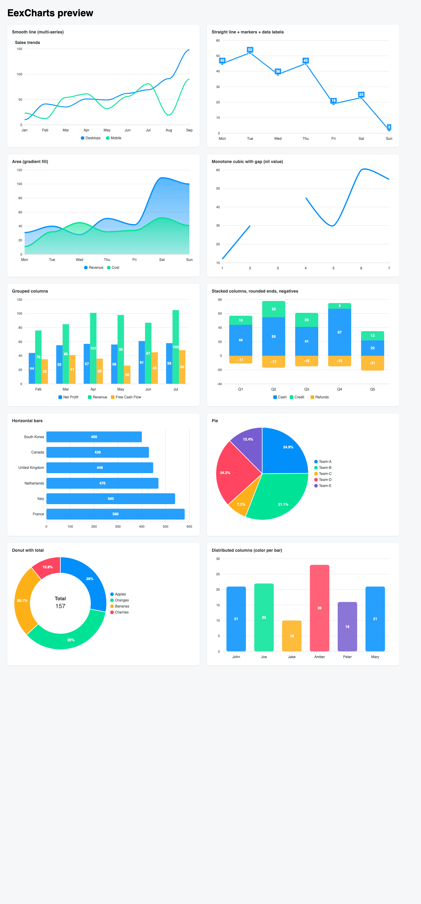

# EexCharts

**Server-side rendered SVG charts for Phoenix LiveView, modeled on
[ApexCharts.js](https://apexcharts.com).**

EexCharts re-implements the rendering logic and default styling of
ApexCharts.js v4.7.0 (the last MIT-licensed release) in pure Elixir. The
entire chart — axes, nice-scale ticks, series geometry, legend, data labels,
and even every tooltip's HTML — is rendered on the server. A single ~100-line
JS hook handles hover: it only toggles pre-rendered tooltips, positions them
next to the cursor, and moves the crosshair. Clicks are plain `phx-click`
bindings, so selections arrive as ordinary LiveView events.



## Features

- **Chart types:** line, area, bar/column (grouped, stacked, horizontal,
  distributed), pie, donut, scatter, bubble, candlestick, box plot, range
  bar, heatmap, treemap (squarified), radar, radial bar, polar area
- **Curves:** `:smooth` (ApexCharts' 35% bezier), `:straight`, `:stepline`,
  `:monotone_cubic` (Fritsch–Carlson), with `nil`-value gaps
- **Axes:** category, numeric, and datetime x-axes (ported TimeScale tick
  logic), logarithmic y-axes, multiple y-axes with `opposite: true`
- **Annotations:** y/x axis lines and bands, labeled point markers
- **Theming:** light and dark (`theme: %{mode: :dark}`), custom palettes
- **ApexCharts fidelity:** same default palette, per-type defaults, nice-scale
  axis algorithm, `column_width`/`bar_height` percentages, border radius
  (`:end` / `:around`), gradient area fills, donut center/total labels,
  percentage slice labels
- **Server-side everything:** charts render without any JS at all; the hook
  is only needed for hover tooltips
- **LiveView-native interactivity:** `on_click` → `phx-click` with
  `phx-value-index` / `phx-value-series`; `on_legend_click` + `hidden_series`
  for legend toggling; optional `push_hover` pushes hover events to the server
- **No dependencies** beyond `phoenix_live_view`

## Installation

```elixir
def deps do
  [
    {:eexcharts, "~> 0.1.0"}
  ]
end
```

Register the hover hook in `assets/js/app.js`:

```js
import EexCharts from "../../deps/eexcharts/priv/static/eexcharts";

const liveSocket = new LiveSocket("/live", Socket, {
  hooks: { EexCharts /*, ...your hooks */ },
});
```

And include the stylesheet in `assets/css/app.css`:

```css
@import "../../deps/eexcharts/priv/static/eexcharts.css";
```

## Usage

```heex
<EexCharts.chart
  id="revenue"
  type={:area}
  series={[
    %{name: "Revenue", data: [31, 40, 28, 51, 42, 109, 100]},
    %{name: "Cost", data: [11, 32, 45, 32, 34, 52, 41]}
  ]}
  categories={~w(Mon Tue Wed Thu Fri Sat Sun)}
/>
```

Pie / donut charts take a plain list of values plus `labels`:

```heex
<EexCharts.chart
  id="share"
  type={:donut}
  series={[44, 55, 41, 17]}
  labels={~w(Apples Oranges Bananas Cherries)}
  options={%{plot_options: %{pie: %{donut: %{labels: %{show: true, total: %{show: true}}}}}}}
/>
```

Options mirror ApexCharts' configuration as nested maps with snake_case atom
keys — `%{stroke: %{curve: :smooth}}` instead of `{stroke: {curve: 'smooth'}}`.
See `EexCharts.Config.defaults/0` for the supported options and their
defaults.

```heex
<EexCharts.chart
  id="quarterly"
  type={:bar}
  series={[
    %{name: "Cash", data: [44, 55, 41, 67]},
    %{name: "Credit", data: [13, 23, 20, 8]}
  ]}
  categories={~w(Q1 Q2 Q3 Q4)}
  options={%{
    chart: %{stacked: true},
    plot_options: %{bar: %{border_radius: 5, border_radius_application: :end}},
    colors: ["#008FFB", "#00E396"]
  }}
/>
```

### Interactions from LiveView

```heex
<EexCharts.chart id="sales" type={:bar} series={@series} on_click="bar-selected" />
```

```elixir
def handle_event("bar-selected", %{"index" => i, "series" => s}, socket) do
  {:noreply, assign(socket, selected: {String.to_integer(s), String.to_integer(i)})}
end
```

`push_hover="chart-hover"` makes the hook push
`%{"id" => id, "index" => index}` to the server on hover, if you want
server-side reactions (e.g. syncing a table row highlight).

### Legend toggling

Legend items are clickable too — ApexCharts' series toggle, done the
LiveView way (the hidden set lives in your assigns):

```heex
<EexCharts.chart
  id="sales"
  type={:line}
  series={@series}
  on_legend_click="toggle-series"
  hidden_series={@hidden}
/>
```

```elixir
def handle_event("toggle-series", %{"series" => s}, socket) do
  i = String.to_integer(s)

  hidden =
    if i in socket.assigns.hidden,
      do: List.delete(socket.assigns.hidden, i),
      else: [i | socket.assigns.hidden]

  {:noreply, assign(socket, hidden: hidden)}
end
```

Hidden series disappear from the chart and tooltips, the axes rescale to
the remaining data, the other series keep their colors, and the legend item
stays visible but dimmed — same behavior as ApexCharts' legend toggle.

Because the chart is a pure function of its assigns, updating `@series`
re-renders the SVG through the normal LiveView diff — that's all there is to
"animations".

### Outside LiveView

```elixir
EexCharts.render("cpu", :line, [%{name: "CPU", data: [10, 20, 15]}],
  categories: ~w(a b c),
  hook: false
)
```

returns safe HTML for controllers, static pages, or emails — no JS involved.

## Development

```sh
mix test                  # unit tests + SVG golden snapshots (fast, no browser)
mix run dev/preview.exs    # writes dev/preview.html, a static visual gallery
mix dev                    # storybook catalog at http://localhost:4444/storybook
```

All chart examples live in one place — `Dev.ChartExamples.all/0`
(`dev/chart_examples.ex`) — shared by the preview gallery, the storybook
stories, and both snapshot test layers, so there's no drift.

### Storybook catalog

`mix dev` boots a dev-only standalone Phoenix server (nothing under `dev/` ships
in the Hex package) hosting a [phoenix_storybook](https://hex.pm/packages/phoenix_storybook)
catalog with one browsable variation per chart. The catalog registers the real
`EexCharts` hook, so hover tooltips and legend toggles work there too.

### Visual regression testing

Two layers guard against visual regressions:

**1. SVG golden snapshots** (`test/svg_snapshot_test.exs`) — fast and
browserless, part of the normal `mix test`. Each example is rendered to SVG and
compared byte-for-byte against a committed golden in `test/snapshots/`. When a
change to the output is intentional, regenerate the goldens:

```sh
EEXCHARTS_UPDATE_SNAPSHOTS=1 mix test test/svg_snapshot_test.exs
```

**2. Pixel screenshots** (`test/visual_test.exs`, tagged `:visual`, excluded by
default) — real headless-Chromium screenshots via
[phoenix_test_playwright](https://hex.pm/packages/phoenix_test_playwright),
catching font/CSS regressions the SVG diff can't see. They need the Playwright
driver + a browser:

```sh
npm --prefix assets install playwright
npx --prefix assets playwright install chromium
mix test --only visual        # asserts against test/visual/baseline/
```

`assert_screenshot/3` saves a baseline on first run and compares thereafter
(diffs land in `test/visual/baseline/__diff__/`). Because pixel output depends
on font rendering, **baselines must be generated in the same environment they're
checked against** — the CI `visual` job runs inside the official
`mcr.microsoft.com/playwright` image (see `.github/workflows/ci.yml`), which is
where the committed baselines are seeded (`mix test --only visual` with the
baseline deleted).

## License

MIT — see [LICENSE](LICENSE). EexCharts is a re-implementation of rendering
logic and default styling from [ApexCharts.js](https://github.com/apexcharts/apexcharts.js)
v4.7.0, © 2018 ApexCharts, used under the terms of its MIT license (included
in LICENSE).
